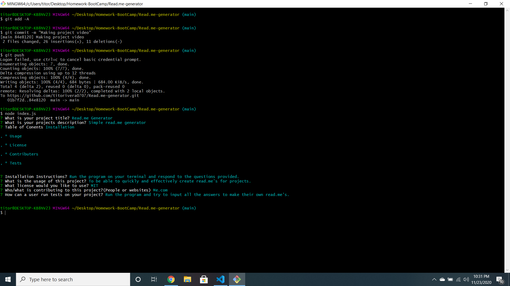

# Read.me Generator

# Description
    
* Have you ever been working on a project and finally finished it and it's absolutely perfect but then you realize you don't know how to even start with your read.me? This application was created exactly for that reason. Whenever I finish a project I am proud of, I realize that I'm not prepared to write a read.me that matches the quality of the project. I decided to make this project to help me and others with creating arguably the most crucial part of any project.

# Table of Contents
 
* Usage 
* Contributers 
* Tests 
* Current Build
* Screen Shots

# Project Usage

* To use this application, you must run it on the terminal and answer all of the questions provided to make a quality read.me file. The answers should be as detailed and concise as possible to make the read.me of a much higher quality. After you are done answering all the questions, the read.me file will appear right below the javascript, html, or any other files you might have on VSC.

# Tests

* Run the program and try to input all the answers to make their own read.me's.

# Current Build

* This build is currently in it's final form. In the future I would like to add more features so that the user can add their own subjects. In the future I would also like to make applications similar to this one for making it easier to create things such as resumes. Making people's life easier in any way is always a good cause for a project.

# Screen Shots

*